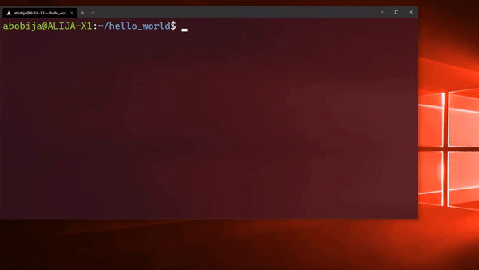

# idfx :zap:

While there is [no support for USB devices on WSL2](https://github.com/microsoft/WSL/issues/4322) for now, this tool comes to help you to flash and monitor [ESP-IDF](https://github.com/espressif/esp-idf) and [ESP8266_SDK](https://github.com/espressif/ESP8266_RTOS_SDK) applications on the [WSL2](https://docs.microsoft.com/en-us/windows/wsl/compare-versions).

> **Info:**<br>Tested on [Ubuntu 20.04 LTS](https://www.microsoft.com/en-us/p/ubuntu-2004-lts/9n6svws3rx71) and [Debian](https://www.microsoft.com/en-us/p/debian/9msvkqc78pk6) distributions.

> **Note:**<br>As a prerequisite for using this tool, [Python :snake:](https://www.python.org) needs to be installed on the Windows.

# Supported ESP-IDF versions

`idfx` supports:
- [ESP-IDF](https://github.com/espressif/esp-idf) version 4.0 and above
- [ESP8266_SDK](https://github.com/espressif/ESP8266_RTOS_SDK) version 3.0 and above

# Installation

Execute next command inside of your WSL to install `idfx`

```sh
curl https://git.io/JyBgj --create-dirs -L -o $HOME/bin/idfx && chmod u+x $HOME/bin/idfx
```

# Usage

Signature:

```
idfx COMMAND [PORT]
```

Where the `PORT` is serial COM Port on the Windows (use the Device Manager to find your port).

For the full usage please execute next command:

```
idfx help
```

# Examples

For most of the cases (when you edit the code of your application) you can use `idfx all COM2` because this command will build, flash and monitor your app, at once. Of course, you need to change `COM2` (in previous command) with correct COM port.

| Command  | Description |
| ------------- | ------------- |
| `idfx all COM2` | Build project, flash and monitor serial output, using port `COM2` |
| `idfx build`  | Build project |
| `idfx flash COM2`  | Flashing project using port `COM2` |
| `idfx monitor COM2`  | Display serial output of port `COM2` |
| `idfx flash COM2 monitor` | Flash project and display serial output, using port `COM2` |
| `idfx erase-flash COM2` | Erase the entire flash, using port `COM2` |
| `idfx help` | Show the `idfx` usage |

# How to install ESP-IDF on WSL2

On [this link](https://abobija.com/blog/electronics/esp-idf-on-wsl2) you can find complete tutorial about how to setup ESP-IDF under WSL2 and how to use `idfx` to build, flash and monitor your ESP application.

# Preview



# Author

[abobija](https://github.com/abobija) - [abobija.com](https://abobija.com)

# License

[MIT](LICENSE)
